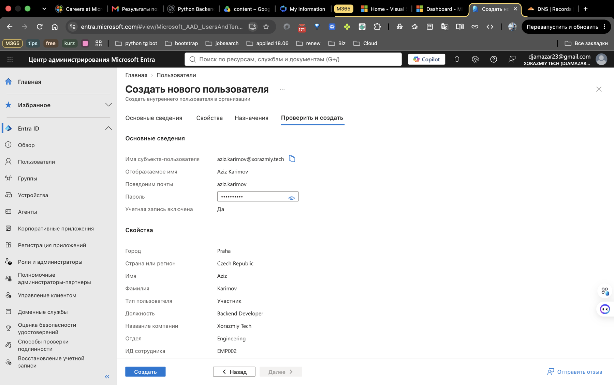
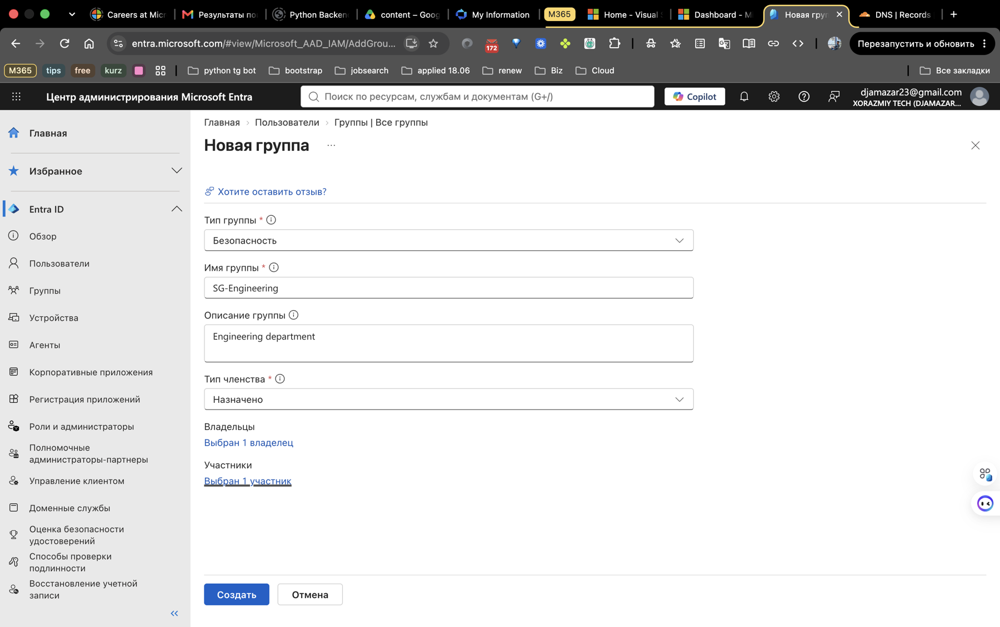
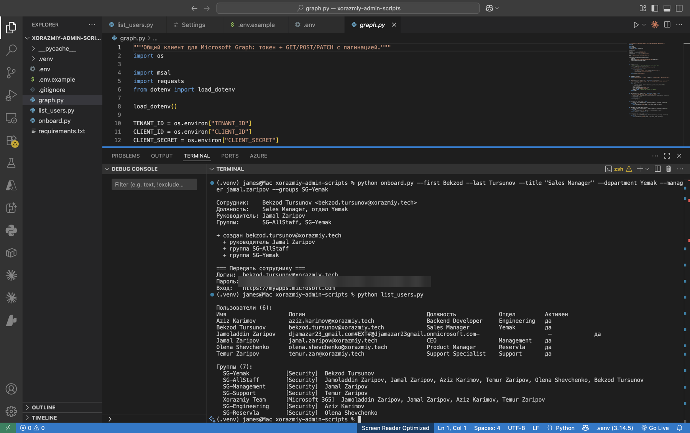
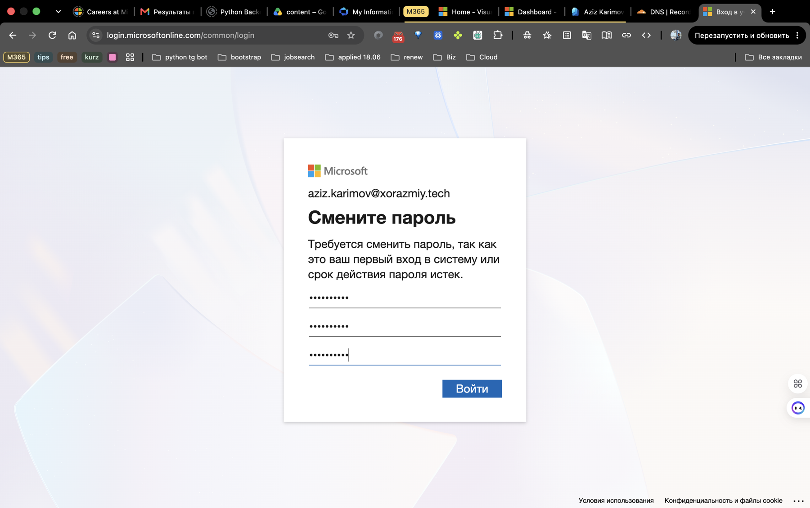
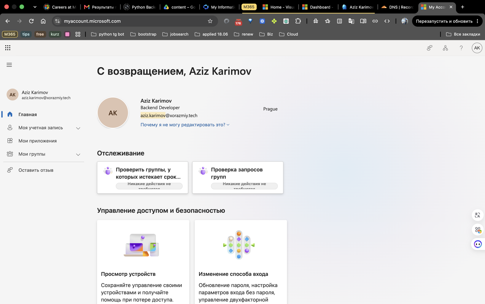
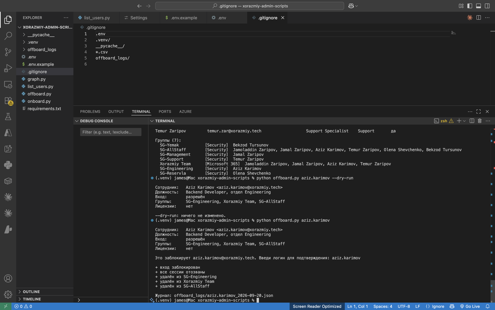
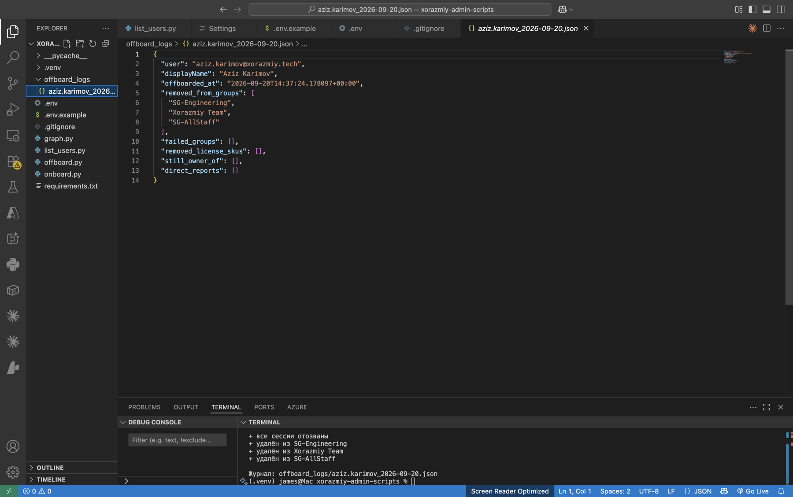
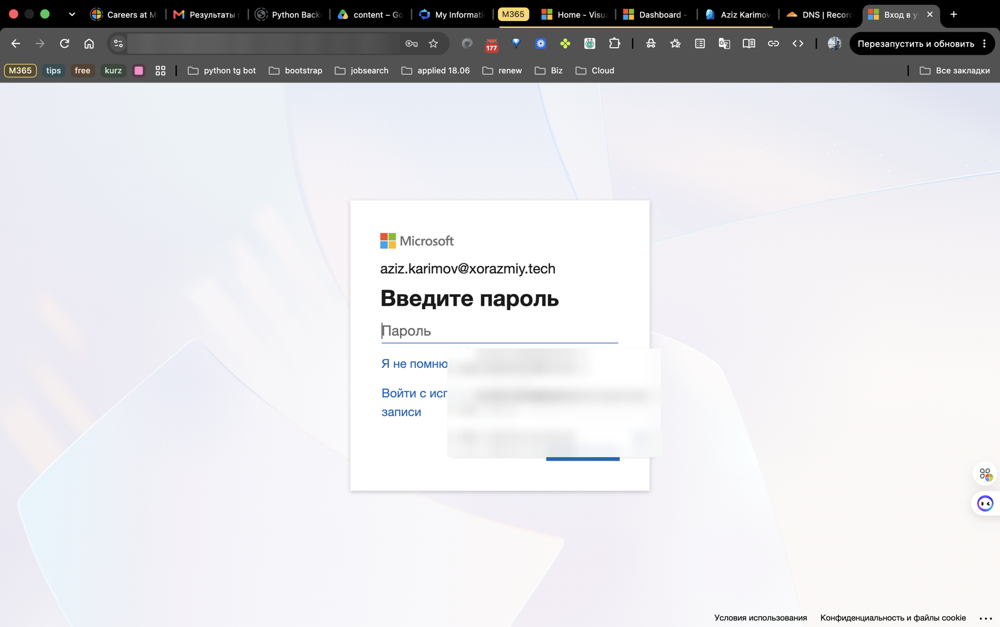
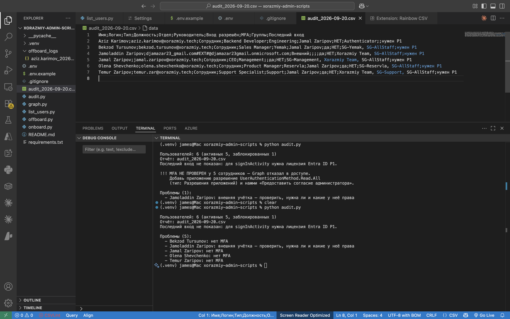

# xorazmiy-admin-scripts

Python-скрипты для администрирования Microsoft Entra ID (Azure AD) через Microsoft Graph API:
онбординг, офбординг и аудит сотрудников.

Задача: убрать ручную рутину, которую в небольшой компании без IT-отдела делают кликами
в портале — долго и с опечатками.

Тестовый тенант: **Xorazmiy Tech** с собственным доменом `xorazmiy.tech`.

---

## Скрипты

| Скрипт | Что делает |
|---|---|
| `list_users.py` | Все пользователи и все группы с участниками |
| `onboard.py` | Создаёт сотрудника: учётка, руководитель, группы отдела, временный пароль |
| `offboard.py` | Блокирует вход, отзывает сессии, снимает лицензии, удаляет из групп, пишет журнал |
| `audit.py` | CSV-отчёт + список проблем: нет MFA, нет отдела/руководителя, недоделанный офбординг, внешние учётки |
| `graph.py` | Общий клиент: токен через MSAL, GET с пагинацией, POST/PATCH/PUT/DELETE |

### Онбординг

```bash
python onboard.py --first Olena --last Shevchenko --title "Product Manager" \
    --department Reservla --manager jamal.zaripov --groups SG-Reservla --dry-run
```

- логин собирается из имени, диакритика убирается (`Novák` → `novak`)
- **все проверки до любых изменений**: пользователя ещё нет, руководитель и группы существуют
- случайный пароль + обязательная смена при первом входе
- каждый сотрудник автоматически попадает в `SG-AllStaff`
- повторные попытки при добавлении в группу (новый объект не сразу виден во всех репликах каталога)
- `--dry-run` показывает план, ничего не меняя

### Офбординг

```bash
python offboard.py temur.zar --dry-run
python offboard.py temur.zar
```

Порядок важен — сначала отрезать доступ, потом прибираться:

1. блокировка входа
2. **отзыв всех сессий** — без этого человек остаётся залогинен на телефоне/ноутбуке
3. снятие лицензий
4. удаление из всех групп
5. предупреждение: подчинённые без руководителя, группы без владельца
6. журнал `offboard_logs/<login>_<дата>.json` — что было сделано, можно откатить

Пользователь не удаляется: учётку держат заблокированной, пока руководитель забирает данные.
Перед изменениями скрипт требует ввести логин для подтверждения.

### Аудит

```bash
python audit.py
```

Сохраняет `audit_<дата>.csv` (открывается в Excel с правильной кодировкой) и выводит проблемы.
Если какую-то проверку выполнить нельзя (нет разрешения, нет лицензии P1), скрипт
**сообщает об этом явно**, а не показывает «чистый» отчёт.

---

## Как это выглядит в работе

Все скриншоты — с живого тенанта. Пароли и идентификаторы замазаны.

### 1. Ручная настройка в портале Entra

Сотрудник с должностью, отделом, компанией и расположением (без расположения нельзя назначить лицензию):



Security-группа отдела: у каждой группы есть владелец и описание, приставка `SG-` показывает тип:



### 2. Онбординг скриптом

Одна команда: учётка, руководитель, группы отдела, временный пароль. Ниже — `list_users.py` подтверждает, что сотрудник на месте и в нужных группах:



### 3. Первый вход сотрудника

Временный пароль работает один раз — система требует сменить его:



Сотрудник видит свой профиль с должностью и офисом, которые заполнил скрипт:



### 4. Офбординг

Сначала `--dry-run`, затем выполнение с подтверждением логином. Вход заблокирован, сессии отозваны, удалён из всех групп:



Журнал офбординга — по нему видно, что сделано, и можно откатить:



Проверка: сотрудник был залогинен в браузере — после офбординга сессия сброшена, система снова просит пароль, а войти уже нельзя:



### 5. Аудит

Первый запуск: разрешение на чтение способов MFA добавлено, но согласие администратора не дано — скрипт **явно предупреждает**, а не показывает «чистый» отчёт. Второй запуск после согласия — найдены сотрудники без MFA. В CSV видно, что Authenticator настроен только у одного:



---

## Разрешения приложения

Регистрация приложения в Entra ID, **только для одного клиента**, тип разрешений — **Application**.
Выданы только те права, которые нужны скриптам (принцип наименьших привилегий):

| Разрешение | Зачем |
|---|---|
| `User.ReadWrite.All` | создание, блокировка пользователей, руководитель, отзыв сессий |
| `Group.ReadWrite.All` | добавление и удаление участников групп |
| `Directory.Read.All` | членство в группах, подчинённые, владельцы |
| `AuditLog.Read.All` | последний вход (нужна лицензия Entra ID P1) |
| `UserAuthenticationMethod.Read.All` | проверка зарегистрированных способов MFA |

---

## Структура тенанта

- Собственный домен `xorazmiy.tech`, подтверждён TXT-записью в Cloudflare (MX не трогался — почта на другом провайдере)
- Security-группы по отделам: `SG-Management`, `SG-Engineering`, `SG-Support`, `SG-Yemak`, `SG-Reservla`, `SG-AllStaff`
- Группа Microsoft 365: `Xorazmiy Team`
- У каждой группы есть владелец и описание
- Оргструктура через поле «Руководитель»

---

## Установка

```bash
python3 -m venv .venv
source .venv/bin/activate
pip install -r requirements.txt
cp .env.example .env   # вписать TENANT_ID, CLIENT_ID, CLIENT_SECRET
python list_users.py
```

`.env` с секретом, CSV-отчёты и журналы офбординга исключены из git (`.gitignore`).

---

## Ограничения

- Тенант на бесплатном Entra ID: нет динамических групп, Conditional Access и даты последнего входа
  (нужна P1). Скрипты это учитывают.
- Лицензий M365 нет, поэтому почтовые ящики не создаются; снятие лицензий в офбординге
  реализовано, но на этом тенанте не срабатывает.
- Аутентификация по client secret — для продакшна лучше сертификат или managed identity.
